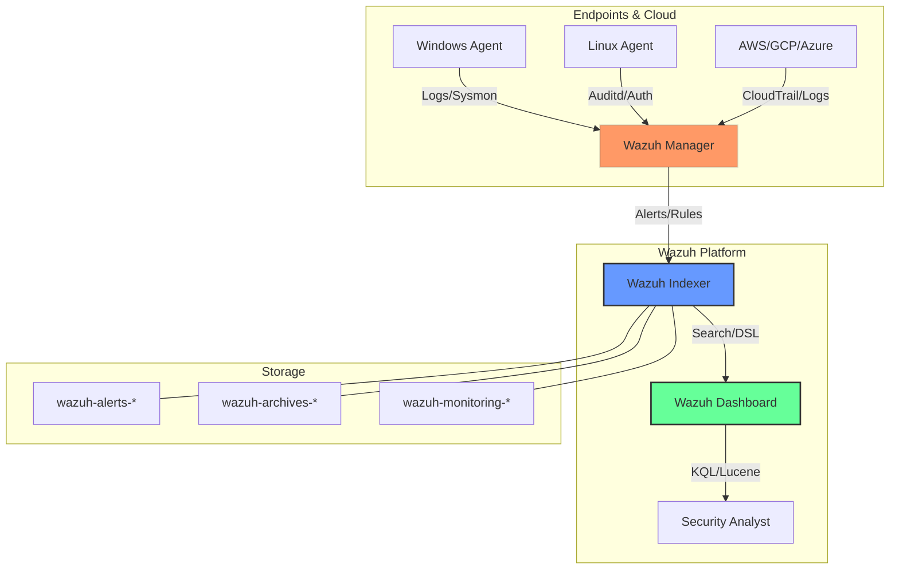

# Wazuh Detection & Forensic Study Guide 🛡️🎓

This repository is a **Structured Study Guide** for mastering Wazuh Dashboard query languages, log analysis, and digital forensics. Whether you are a student, a junior SOC analyst, or a seasoned detection engineer, this curriculum is designed to elevate your technical hunting skills.

---

## 👨‍💻 Author Information

- **Author:** Boni Yeamin
- **Email:** [boniyeamin.cse@gmail.com](mailto:boniyeamin.cse@gmail.com)
- **Role:** Security Researcher / Detection Engineer

---

## 🏗️ Wazuh Ecosystem Architecture

Understanding the data flow is key to effective querying. The diagram below illustrates how raw events are processed, indexed, and made available for analysis.

1.  **Agents & Cloud**: Collect raw telemetry (Sysmon, Auditd, CloudTrail).
2.  **Wazuh Manager**: Decodes logs, matches them against 4000+ rules, and triggers alerts.
3.  **Wazuh Indexer (OpenSearch)**: Stores alerts in a distributed, high-performance search engine.
4.  **Wazuh Dashboard**: The visualization interface where you use **KQL**, **Lucene**, and **DSL** to hunt threats.

---

## 🧭 Repository Index (The Learning Path)

This repository is structured as a comprehensive curriculum. Follow the modules in order or jump to specific topics using the index below.

| # | Module Name | Primary Focus | Level | Link |
| :-- | :--- | :--- | :--- | :--- |
| **01** | [Architecture Overview](docs/dashboard-query-languages/01-overview.md) | Wazuh Architecture & Alert JSON | 🟢 Beginner | [Module 01](docs/dashboard-query-languages/01-overview.md) |
| **02** | [KQL Master Guide](docs/dashboard-query-languages/02-kql-master.md) | 150+ Detection Queries (Win/Linux) | 🔵 Intermediate | [Module 02](docs/dashboard-query-languages/02-kql-master.md) |
| **03** | [Lucene Advanced Guide](docs/dashboard-query-languages/03-lucene-advanced.md) | Regex, Fuzzy, & Proximity Search | 🔴 Advanced | [Module 03](docs/dashboard-query-languages/03-lucene-advanced.md) |
| **04** | [OpenSearch Query DSL](docs/dashboard-query-languages/04-opensearch-dsl.md) | JSON-based Queries & API Automation | ⚛️ Expert | [Module 04](docs/dashboard-query-languages/04-opensearch-dsl.md) |
| **05** | [Threat Hunting Pack](docs/dashboard-query-languages/05-threat-hunting-pack.md) | MITRE ATT&CK Mapped Queries | 🎯 Hunter | [Module 05](docs/dashboard-query-languages/05-threat-hunting-pack.md) |
| **06** | [SOC Playbooks](docs/dashboard-query-languages/06-soc-playbooks.md) | Investigation Scenarios (Ransomware/Breach) | 📋 Analyst | [Module 06](docs/dashboard-query-languages/06-soc-playbooks.md) |
| **07** | [Performance & Scaling](docs/dashboard-query-languages/07-performance-tuning.md) | Optimization for Large SOCs | ⚡ Ops | [Module 07](docs/dashboard-query-languages/07-performance-tuning.md) |
| **08** | [Common Mistakes](docs/dashboard-query-languages/08-common-mistakes.md) | Troubleshooting & Pitfalls | ⚠️ Ops | [Module 08](docs/dashboard-query-languages/08-common-mistakes.md) |
| **09** | [Quick Reference](docs/dashboard-query-languages/09-quick-reference.md) | One-Page Syntax & Templates | ⚡ Rapid | [Module 09](docs/dashboard-query-languages/09-quick-reference.md) |
| **10** | [Forensic Analysis](docs/dashboard-query-languages/10-forensic-analysis.md) | Persistence & Deep Forensics | 🔍 Forensic | [Module 10](docs/dashboard-query-languages/10-forensic-analysis.md) |
| **11** | [Log Types Dictionary](docs/dashboard-query-languages/11-log-types-dictionary.md) | Field Mappings (Sysmon/SSH/Web) | 📘 Study | [Module 11](docs/dashboard-query-languages/11-log-types-dictionary.md) |
| **12** | [Investigative Commands](docs/dashboard-query-languages/12-investigative-commands.md) | Suspicious OS Command Hunting | 🛠️ Hunt | [Module 12](docs/dashboard-query-languages/12-investigative-commands.md) |
| **13** | [Wazuh Lab Setup](docs/dashboard-query-languages/13-lab-setup.md) | Docker Compose & OVA Deployment | 🧪 Lab | [Module 13](docs/dashboard-query-languages/13-lab-setup.md) |
| **14** | [External Resources](docs/dashboard-query-languages/14-learning-resources.md) | Official Training & Community Labs | 🔗 Mastery | [Module 14](docs/dashboard-query-languages/14-learning-resources.md) |

---

## 🛡️ Why This Project?
- **Forensic Focus**: Moves beyond "was there a login" to "what did they do to the registry".
- **Study-Ready**: Categorized field mappings and investigative command libraries.
- **250+ Production Queries**: Each query is tested and ready for production deployment.
- **MITRE Mapped**: Learn to map your hunting activity to real attacker tactics.

---

## 🤝 Community & Contribution
This guide is open-source under the MIT License. If you find a useful query, please contribute via a Pull Request!

---

**Developed for the Cybersecurity Community**
*Version 1.2 - The Author & Mastery Edition*

## TL;DR

- A concise, hands-on curriculum for learning Wazuh Dashboard querying, log analysis, and forensic workflows. Start with Module 01 (overview) and follow modules in order for practical examples and production-ready queries.
