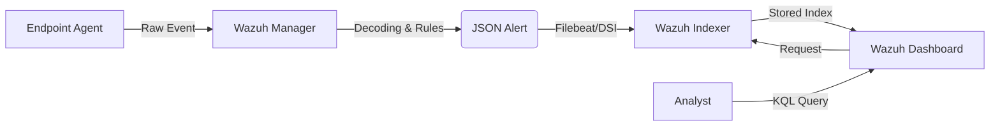

# 01 - Wazuh Dashboard Overview 🏢

This document provides a technical overview of the Wazuh Dashboard architecture, its integration with OpenSearch, and how security events are structured and indexed.

---

## 🏗️ Architecture Overview

The Wazuh Dashboard is the visualization layer of the Wazuh SIEM. It is built upon **OpenSearch Dashboards** and interacts directly with the **Wazuh Indexer** (OpenSearch) and the **Wazuh Manager**.

### Key Components
1.  **Wazuh Indexer:** A highly scalable, full-text search engine (OpenSearch) that stores and indexes alerts.
2.  **Wazuh Dashboard:** The web-ui for searching, visualizing, and managing alerts.
3.  **Wazuh Manager:** Processes events from agents, applies rules, and sends alerts to the indexer.
4.  **Wazuh API:** Provides programmatic access to the manager and indexer.

### 🌐 End-to-End Data Pipeline



---

## 📊 Index Patterns

Wazuh uses specific index patterns to organize data. Understanding these is crucial for efficient querying.

-   **`wazuh-alerts-*`**: Stores all security alerts generated by the manager. This is the primary index for SOC operations.
-   **`wazuh-archives-*`**: Stores all events (even those that didn't trigger a rule). Usually used for compliance and deep forensics.
-   **`wazuh-monitoring-*`**: Stores health and status data for agents and managers.
-   **`wazuh-statistics-*`**: Stores performance metrics.

---

## 📝 Alert Structure & Field Mapping

Wazuh alerts are stored as JSON documents. Fields are structured into several root objects:

### 1. `rule.*`
Contains metadata about the triggered rule.
- `rule.id`: Unique identifier for the rule (e.g., `5710`).
- `rule.level`: Severity (0 to 16).
- `rule.groups`: Array of groups (e.g., `["sshd", "pci_dss"]`).
- `rule.description`: Human-readable summary.

### 2. `agent.*`
Metadata about the agent that sent the event.
- `agent.id`: Unique ID (e.g., `001`).
- `agent.name`: Hostname.
- `agent.ip`: IP address.

### 3. `data.*`
The most important object. It contains the raw event data (e.g., Sysmon, Logfile contents).
- `data.win.eventdata.*`: For Windows events.
- `data.srcip`: Source IP.
- `data.dstport`: Destination port.

### 4. `manager.*`
Metadata about the Wazuh Manager that processed the alert.

---

## 🔬 Sample Alert JSON

```json
{
  "timestamp": "2024-02-22T10:00:00.000Z",
  "rule": {
    "level": 12,
    "description": "SSHD: Authentication failed from a known bad IP.",
    "id": "100201",
    "groups": ["sshd", "attack"]
  },
  "agent": {
    "id": "005",
    "name": "linux-prod-01"
  },
  "data": {
    "srcip": "1.2.3.4",
    "user": "root"
  },
  "location": "/var/log/auth.log"
}
```

---

## ⚙️ Field Types & Performance

Wazuh/OpenSearch uses two main string types:
1.  **`keyword`**: Used for exact matches, sorting, and aggregations. (e.g., `agent.id`). **Fastest for searching.**
2.  **`text`**: Used for full-text search. These are analyzed (broken into tokens). (e.g., `full_log`).

> [!IMPORTANT]
> Always prefer `keyword` fields (e.g., `field.keyword`) when performing exact match queries in Large Environments to avoid high CPU usage on the indexer.

---

## 🏢 Multi-Tenant Considerations
In large organizations, Wazuh supports **OpenSearch Multi-Tenancy**. This allows different SOC teams (e.g., Regional SOC vs Global SOC) to see only their relevant alerts using **Rule-Based Access Control (RBAC)** applied at the indexer level.

---

**Next Module: [02 - KQL Complete Master Guide](02-kql-master.md)**

[Return to Index](../../README.md)
