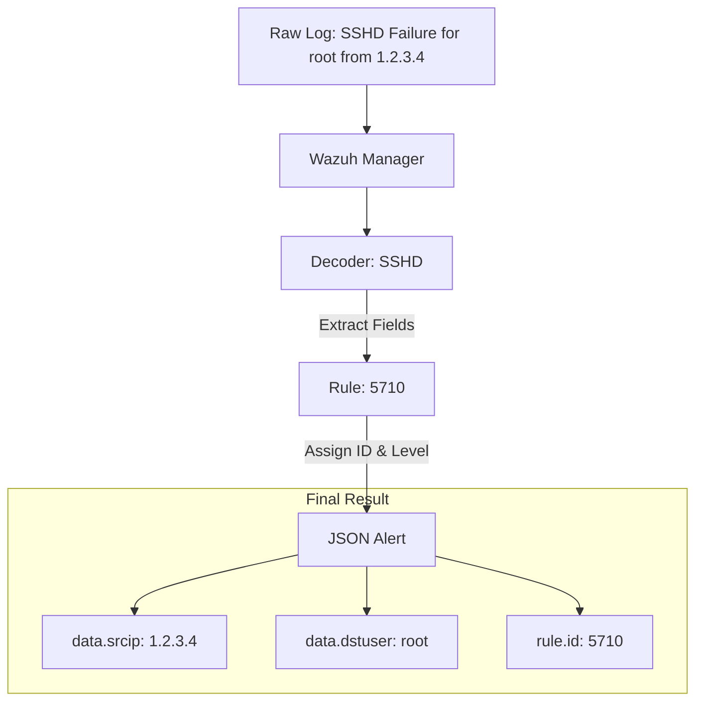

# 11 - Log Types & Field Mapping Dictionary 📘

This document provides a comprehensive lookup for the most common log sources in Wazuh and explains how their fields are normalized for querying.

---

## 🔄 The Normalization Flow

Wazuh takes unstructured or semi-structured logs and transforms them into the **Elastic Common Schema (ECS)**-inspired JSON format.

---

## 🖥️ Windows Logs (Sysmon & Event Channel)

Wazuh normalizes Windows events into the `data.win` object.

### 1. Process Creation (Sysmon Event ID 1)
- **Field:** `data.win.eventdata.image` (The executable path)
- **Field:** `data.win.eventdata.parentImage` (The parent process path)
- **Field:** `data.win.eventdata.commandLine` (The full command executed)
- **Field:** `data.win.eventdata.user` (The user who started the process)

### 2. Network Connection (Sysmon Event ID 3)
- **Field:** `data.win.eventdata.destinationIp` (External destination)
- **Field:** `data.win.eventdata.destinationPort` (Port used)
- **Field:** `data.win.eventdata.protocol` (e.g., `tcp`, `udp`)

---

## 🐧 Linux Logs (SSHD & Auditd)

### 1. SSH Authentication (`/var/log/auth.log`)
- **Field:** `data.srcip` (Attacker/User Source IP)
- **Field:** `data.dstuser` (Target Username)
- **Field:** `data.status` (e.g., `success`, `failure`)

### 2. Sudo Execution
- **Field:** `data.user` (User who invoked sudo)
- **Field:** `data.command` (The command executed with elevated privileges)

---

## 🌐 Web Server Logs (Apache & Nginx)

Web logs are usually sent via the Wazuh agent in `syslog` format.

### 1. Access Logs
- **Field:** `data.srcip` (Client IP)
- **Field:** `data.url` (Requested Path)
- **Field:** `data.id` (HTTP Status Code, e.g., `404`)
- **Field:** `data.user_agent` (Browser/Tool string)

### 2. Error Logs
- **Field:** `full_log` (Raw error message, use KQL/Lucene to parse)

---

## ☁️ Cloud Logs (AWS CloudTrail)

Wazuh integrates with AWS via the `wazuh-modules-v.0` (S3/CloudTrail).

### 1. Management Events
- **Field:** `data.aws.eventName` (e.g., `ConsoleLogin`, `RunInstances`)
- **Field:** `data.aws.userIdentity.userName` (The IAM user)
- **Field:** `data.aws.sourceIPAddress` (The IP used to access the console)
- **Field:** `data.aws.errorCode` (e.g., `AccessDenied`)

---

## 🧬 Generic Field Mapping (ECS Style)

Wazuh uses its own naming convention but follows some Elastic Common Schema (ECS) principles.

| Topic | Wazuh Field | Purpose |
| :--- | :--- | :--- |
| **Source** | `data.srcip` | Origin of the event |
| **Destination** | `data.dstip` | Target of the activity |
| **User** | `data.win.eventdata.targetUserName` | Impacted user (Windows) |
| **Path** | `data.file` | Modified or accessed file |
| **Action** | `data.aws.eventName` | Action taken in the Cloud |

---

## 🚀 Study Tip: Using `_mapping`
To see the exact field names available for YOUR specific environment, use the **Dev Tools** in the Wazuh Dashboard and run:
`GET /wazuh-alerts-*/_mapping`
This will show you every field name and its type (`keyword`, `text`, `integer`).

---

**Previous: [10 - Forensic Analysis](10-forensic-analysis.md)** | **Next: [12 - Investigative Commands](12-investigative-commands.md)**

[Return to Index](../../README.md)
