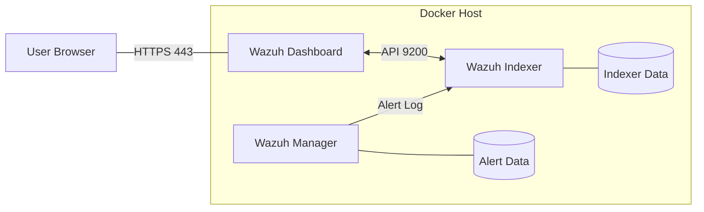

# 13 - Wazuh Lab Setup Guide 🧪

To effectively study the queries and forensic techniques in this guide, you need a working lab environment. This document outlines the two fastest ways to deploy a Wazuh lab.

---

## 🏗️ Lab Architecture (Docker)

When deploying via Docker, the services interact over an internal virtual network. Understanding this helps in troubleshooting connectivity between the Dashboard and Indexer.



---

## 🐋 Option 1: Docker Compose (Recommended)
This is the fastest method for most researchers. It deploys the Wazuh Indexer, Server, and Dashboard in minutes.

### 1. Prerequisites
- Docker and Docker Compose installed.
- Minimum 8GB RAM allocated to Docker.

### 2. Deployment Steps
```bash
# Clone the Wazuh Docker repository
git clone https://github.com/wazuh/wazuh-docker.git -b v4.7.2
cd wazuh-docker/single-node

# Start the deployment
docker-compose up -d
```
*Wait ~5 minutes for all services to initialize. Access the dashboard at `https://localhost` (User: `admin`, Pass: `SecretPassword`).*

---

## 📦 Option 2: Wazuh OVA (Virtual Machine)
Best for those who want a pre-configured environment in VirtualBox or VMware.

1.  **Download**: Get the latest OVA from the [Wazuh Documentation](https://documentation.wazuh.com/current/deployment-options/virtual-machine/virtual-machine.html).
2.  **Import**: Import the file into your hypervisor.
3.  **Resources**: Allocate at least **2 vCPUs** and **4GB RAM**.
4.  **Network**: Set the network adapter to **Bridged** or **Host-Only** to access the web UI from your host machine.

---

## 🎯 The "Golden Configuration" for Forensics
To simulate real-world attacks, you must configure your agents correctly:

### 1. Install Sysmon (Windows)
Wazuh's most powerful telemetry comes from Sysmon.
1.  Download Sysmon from [Sysinternals](https://docs.microsoft.com/en-us/sysinternals/downloads/sysmon).
2.  Install with a configuration file (e.g., [SwiftOnSecurity's config](https://github.com/SwiftOnSecurity/sysmon-config)).
    `sysmon.exe -i sysmonconfig.xml`

### 2. Enable Auditd (Linux)
Ensure the Wazuh agent is reading the audit logs.
`sudo apt-get install auditd`
Then, add the desired rules to `/etc/audit/rules.d/audit.rules`.

### 3. Wazuh Agent Config (`ossec.conf`)
Ensure you are monitoring the right event channels:
```xml
<localfile>
  <location>Microsoft-Windows-Sysmon/Operational</location>
  <log_format>eventchannel</log_format>
</localfile>
```

---

## 📈 Single-Node Resource Tuning

If your lab is slow, apply these settings to your `docker-compose.yml` or VM.

1.  **JVM Heap Size:** Set `INDEXER_JAVA_OPTS` to at least `-Xms2g -Xmx2g` (50% of your RAM).
2.  **Shard Optimization:** For small labs, use 1 primary shard and 0 replicas for all indices:
    `SET /_settings { "index": { "number_of_replicas": 0 } }`
3.  **Disable Heavy Modules:** If you aren't testing Cloud, disable the `aws-s3` and `azure-logs` modules to save CPU.

## 🔐 Security Header Hardening
For production-like environments, ensure the Dashboard serves secure headers.
- **CSP:** Add `server.csp.rules` to `opensearch_dashboards.yml` to prevent XSS.
- **SSL/TLS:** Always use at least TLS 1.2 for the Dashboard-to-Indexer communication.

---

## 🚀 Study Tip: "Generate & Hunt"
Once your lab is up, run some of the **[Module 12 Investigative Commands](12-investigative-commands.md)** on your victim agent. Then, wait 30 seconds and try to find the resulting alerts in the Wazuh Dashboard using the queries from **[Module 02](02-kql-master.md)**.

---

**Previous: [12 - Investigative Commands](12-investigative-commands.md)** | **Next: [14 - Learning Resources](14-learning-resources.md)**

[Return to Index](../../README.md)
